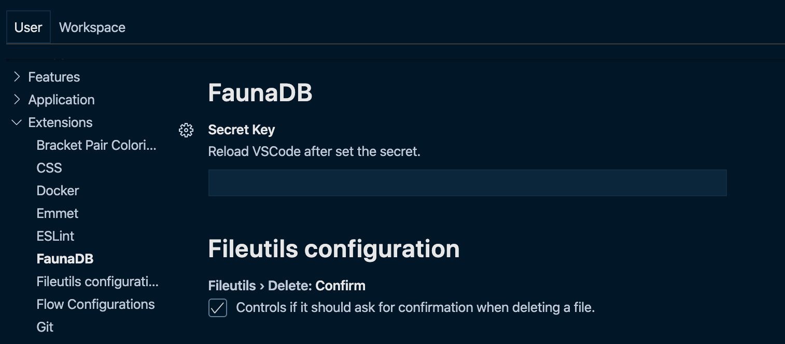
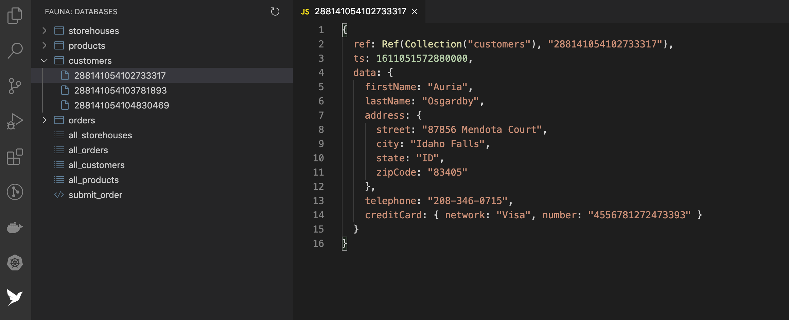
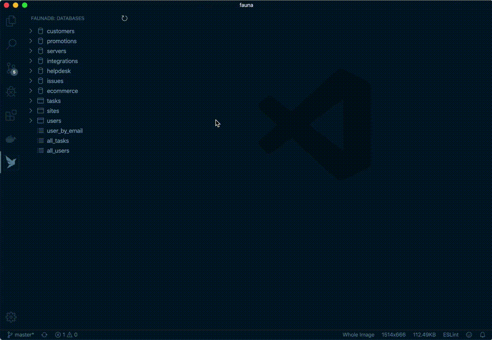
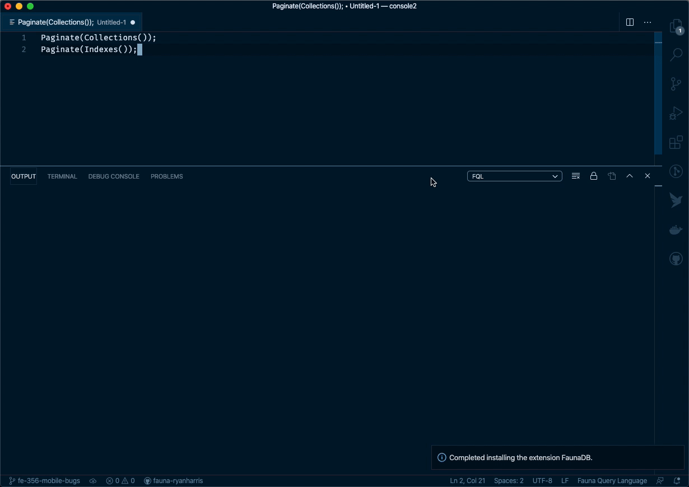
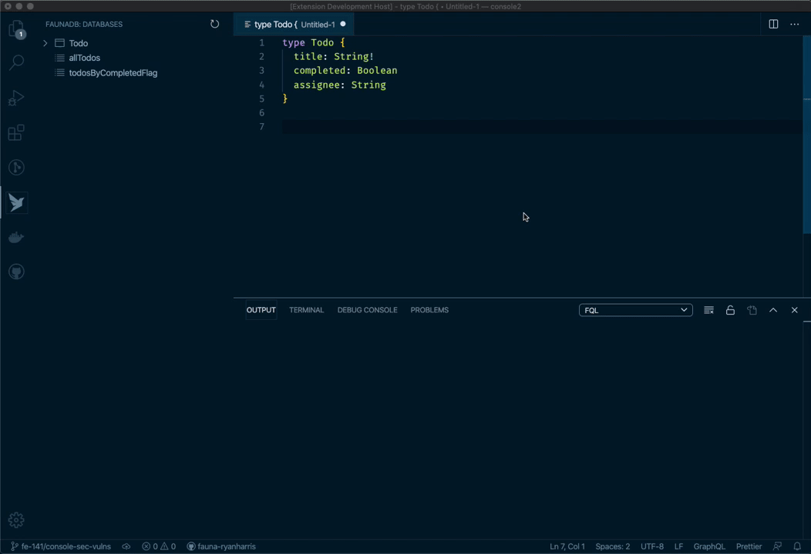
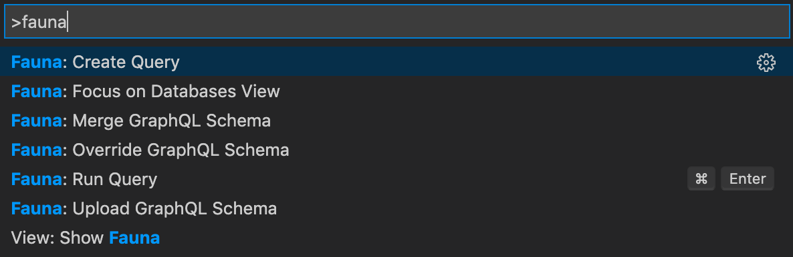

# Fauna extension for VS Code

Source code for the Fauna VS Code extension.

This extension allows users to browse their Fauna databases and run [FQL queries](https://docs.fauna.com/fauna/current/api/fql/) from directly inside VS Code.

**Note: This extension does not yet support FQL syntax highlighting or auto-complete, but this is planned for a future release. Alternatively, please feel free to submit a PR to help out!**

## Prerequisites

Be sure to install [VS Code](https://code.visualstudio.com/Download) and create a [Fauna account](https://dashboard.fauna.com/accounts/register).

## Getting started

### Prerequisites

1. Create a [Fauna account](https://dashboard.fauna.com/accounts/register)

2. Install [VS Code](https://code.visualstudio.com/Download)

3. Install this extension [in VS Code](https://code.visualstudio.com/docs/editor/extension-gallery)

### 1. Set your secret key

You can persist a Fauna secret using either a `.faunarc` file in your project or using the settings in the VS Code IDE. 

Persisting a secret in VS Code settings will set the key at a global level for all projects.  A project can override the global key by including a `.faunarc` config file in the root of the project.

#### Using a `.faunarc` file for a project

1. **IMPORTANT:** Add `.faunarc` to your `.gitignore`.
2. Create a file `.faunarc` in your project root folder.
3. Add the following code `FAUNA_KEY=your-secret-key`.

#### Using VS Code to store a global key

1. To access to all of your databases from VS Code, you will need to create an account admin key from your [Fauna Dashboard](https://dashboard.fauna.com/keys). **Note: You can also provide VS Code access to an individual database by generating an admin key from that database's "Security" tab, but the extension does not support "server" keys at this time.**

2. Copy the secret and paste it into the Fauna extension settings. You can find the Fauna extension settings by either:

- Selecting `View > Extensions` to open the Extensions pane, scrolling down in the list of installed extensions until you see Fauna, then clicking the cog icon in the lower right to open the extension settings.

- Selecting `Code > Preferences > Settings > Extensions > Fauna` from the VS Code menu.

3. Restart VS Code after setting or changing your secret.

- `fauna.adminSecretKey`: Your database admin secret.

> WARNING: Be careful! To avoid exposing this secret, do not commit it to your local `.vscode` configuration.

### 2. Browse database/s

1. Click on the Fauna bird icon in the Activity bar on the far left. If you do not see the Activity Bar, select `View > Appearance > Show Activity Bar` from the VS Code menu.
2. You should now see a pane listing all of your databases, indexes, collections, documents, and functions.

**Note: Browsing is read-only at this time, but you can edit all of your data by running queries (see next section).**

### 3. Run queries

1. Open the command palette with the keyboard shortcut `Cmd` + `Shift` + `P` if you are on a Mac (or `Ctrl` + `Shift` + `P` on a PC).

2. Create a new file from which to run your [FQL queries](https://docs.fauna.com/fauna/current/api/fql/) by either:

- Typing `Fauna: Create query` to select that command from the command palette dropdown. This will open a new tab with the `Paginate(Collections())` query already included.

- Creating a new file with the `.fql` file extension.

3. Open the command palette again (with `Cmd` + `Shift` + `P`), but this time start typing `Fauna: Run query` to select that command from the dropdown.

4. The Output panel should open up from the bottom of the VS Code window, displaying the query's results.

5. If you have multiple FQL expressions in your file, you can also trigger them individually by highlighting the expression you want to execute.

### 4. Upload GraphQL Schema

1. Open a `.graphql` or `.gql` file containing your GraphQL schema as per the [Fauna specification](https://docs.fauna.com/fauna/current/api/graphql).

2. Open the command palette with the keyboard shortcut `Cmd` + `Shift` + `P` if you are on a Mac (or `Ctrl` + `Shift` + `P` on a PC).

3. Fauna allows two [modes](https://docs.fauna.com/fauna/current/api/graphql/endpoints#modes) of uploading schemas, and there are commands for each of these.

- Type `Fauna: Upload GraphQL Schema` to upload in the default `merge` mode.

- Or, type `Fauna: Merge GraphQL Schema` for explicitly uploading in `merge` mode.

- Or, type `Fauna: Override GraphQL Schema` for uploading in `override` mode. (**WARNING**: `override` mode causes data loss for any previous GraphQL schema. Any collections, indexes, or documents that are not involved in GraphQL are not affected.)

## Features

**Commands**

- Fauna: Create query
- Fauna: Run query
- Fauna: Upload GraphQL Schema
- Fauna: Merge GraphQL Schema
- Fauna: Override GraphQL Schema

## Built With

- [Fauna](https://fauna.com/)
